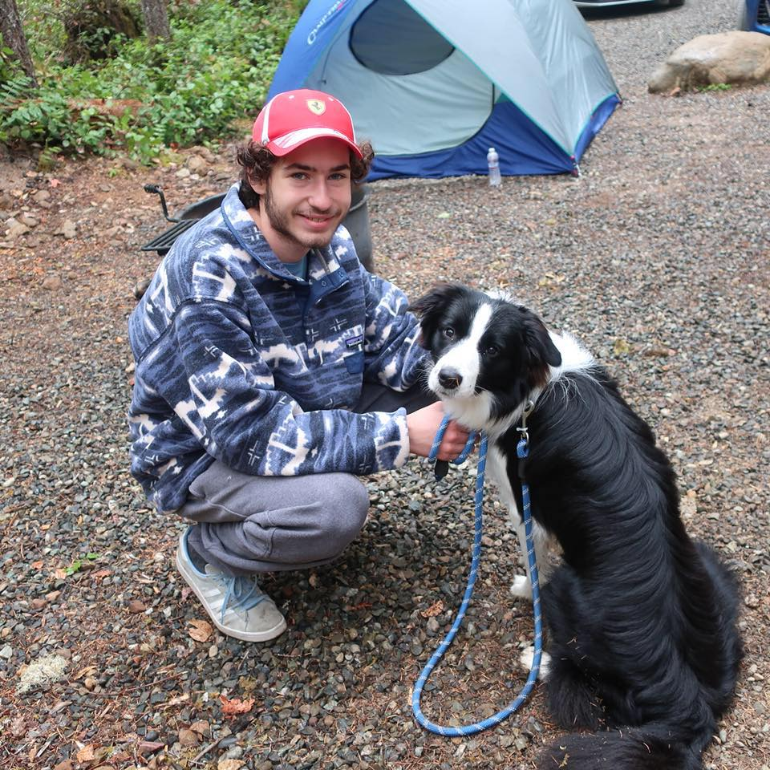

<div style="text-align: center;"><h1>Wilson Koder</h1></div>

<hr>

## Projects

The code examples presented with each project are showcases of the core parts of each program.

### [KodeEngine](https://github.com/WilsonKoder/KodeEngine)

- C++ & OpenGL based 3D game engine with a simple interface to handle input and graphics rendering

  ```C++
  void KodeEngine::FPSCam::update(GLuint program)
  {
      dir = glm::vec3(cos(verticalAngle) * sin(horizontalAngle), sin(verticalAngle), cos(verticalAngle) * cos(horizontalAngle));
      right = glm::vec3(sin(horizontalAngle - 3.14 / 2.0f), 0, cos(horizontalAngle - 3.14f / 2.0f));
      up = glm::cross(right, dir);

      View = glm::lookAt(pos, pos + dir, up);
      MVP = Projection * View * Model;
      sendMatrix(program);
  }
  ```

### [GameLang](https://github.com/WilsonKoder/GameLang)

- Python based language geared towards child/beginner programmers looking to make simple 2D games without the complexity of a fully featured programming language

  ```python
  for line in source:
          # core lang functions
          if "print" in line:
              splitted = line.split(": ")
              printText = splitted[1].rstrip()
              if "\"" not in splitted[1]:
                  print(str(variables[printText]).rstrip())
              else:
                  print(str(printText).replace("\"", ""))
          if "is" in line:
              splitted = line.split("is")
              varName = splitted[0].rstrip().replace(" ", "")
              varVal = splitted[1].rstrip().replace(" ", "")
              variables[varName] = varVal
  ```

  ```GameLang
  #GameLang Code
  x is "Hello, World!"
  print x

  start "windowName" 800 600 #Creates a window

  draw_image ./someImage.png 300 400
  ```

### [PyBoxes](https://github.com/WilsonKoder/PyBoxes)

- A showcase of the Pygame framework and the Pymunk physics library

  ```python
  if mouse_down:
          pos = pygame.mouse.get_pos()
          if pos[1] < 500:
              if liquid_sim:
                  for i in range(0, 20):
                      pos = pygame.mouse.get_pos()  # get the mouse pos
                      real_pos = pymunk.pygame_util.to_pygame(pos, screen)
                      new_particle = create_circle(real_pos)  # create a circle object
                      liquid_particles.append(new_particle)  # add it to the list
              else:
                  pos = pygame.mouse.get_pos()  # get the mouse pos
                  real_pos = pymunk.pygame_util.to_pygame(pos, screen)
                  new_circle = create_circle(real_pos)  # create a circle object
                  circles.append(new_circle)  # add it to the list
  ```

### [PyVoxel](https://github.com/WilsonKoder/PyVoxel)

- A 2D voxel based game with its own original physics engine and voxel system

  ```python
  elif event.type == pygame.MOUSEBUTTONDOWN:
              if event.button == LEFT:
                  mousePos = pygame.mouse.get_pos()
                  mouseX = mousePos[0]
                  mouseY = mousePos[1]
                  for block in blocks:
                      blockX = block.pos[0]
                      blockY = block.pos[1]
                      if mouseX < blockX + 25 and mouseX + 25 > blockX and mouseY < blockY + 25 and mouseY + 25 > blockY:
                          # collision detected
                          blocks.remove(block)
                  for block in blocks:
                      blockX = block.pos[0]
                      blockY = block.pos[1]
  ```

  ​

More projects can be found [here](https://github.com/WilsonKoder), at my GitHub page.

## Skills

- C++ 
  - [OpenGL](https://www.opengl.org/)
  - [SDL](https://www.libsdl.org/)
- C#
  - [MonoGame](http://www.monogame.net/)
  - XNA
- Python
  - [Pygame](https://www.pygame.org/news)
  - [Pymunk](http://www.pymunk.org/en/latest/)
  - [Flask](http://flask.pocoo.org/)
- HTML/CSS
- [Unity3D](https://unity3d.com)
- [Unreal Engine](https://www.unrealengine.com)
- Mobile Development


## About Me

I grew up in Hong Kong and found a love for programming at a young age, I won a few awards throughout high school for computer science. I specifically focused my energy into game development. I also enjoy teacher programming to children and have since developed my own small language to make it easier for kids to program real games. I now study at the Lake Washington Institute of Technology in Kirkland, Washington and am completing an AAS in Computing and Software Development. 



## A Little Extra

<iframe src="https://trinket.io/embed/pygame/1a6c6e83ec" width="100%" height="600" frameborder="0" marginwidth="0" marginheight="0" allowfullscreen></iframe>

----------------------------

<div style="text-align: center;">:space_invader: - <a href="https://github.com/WilsonKoder/">GitHub</a> - <a href="https://youtube.com/WilsonKoder">YouTube</a> - <a href="mailto:s-wilson.koder@lwtech.edu">Contact Me</a> - <a href="#top">Back to Top</a> - :video_game:</div>